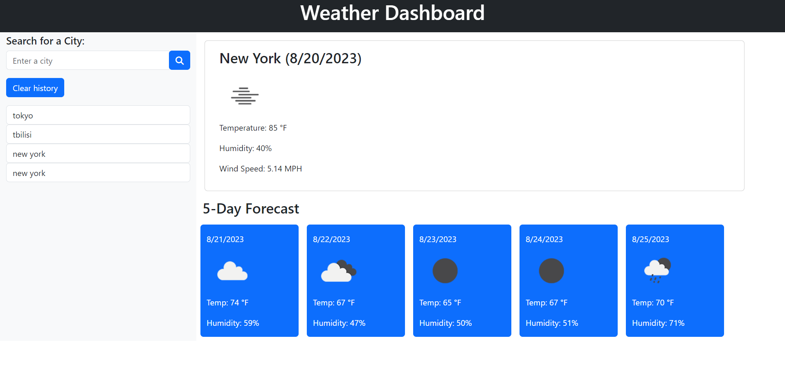

# Weather-dashboard

## Description

This website was designed for travels who are thinking about visiting particular city. They can type in any city in search bar and it will display weather for 5 days. 

## User Story 

AS A traveler

I WANT to see the weather outlook for multiple cities

SO THAT I can plan a trip accordingly

## Acceptance Criteria 

GIVEN a weather dashboard with form inputs
WHEN I search for a city

THEN I am presented with current and future conditions for that city and that city is added to the search history

WHEN I view current weather conditions for that city

THEN I am presented with the city name, the date, an icon representation of weather conditions, the temperature, the humidity, and the the wind speed

WHEN I view future weather conditions for that city

THEN I am presented with a 5-day forecast that displays the date, an icon representation of weather conditions, the temperature, the wind speed, and the humidity

WHEN I click on a city in the search history

THEN I am again presented with current and future conditions for that city

## Installation

N/A

## Usage

On the left hand side Traveler can type in the city they are interested in and in the center they will see 5 days forecast for desired city. 

Deployed site/Website URL:  https://misachka.github.io/Weather-App/

## Mock-up

## Credits

https://openweathermap.org/forecast5

https://getbootstrap.com/

https://cdnjs.com/libraries/font-awesome 

https://axios-http.com/docs/intro 

https://www.w3schools.com/howto/howto_js_temperature_converter.asp 

Used module 6 activities/mini project for reference.

## License

Please refer to the LICENSE in the repo.